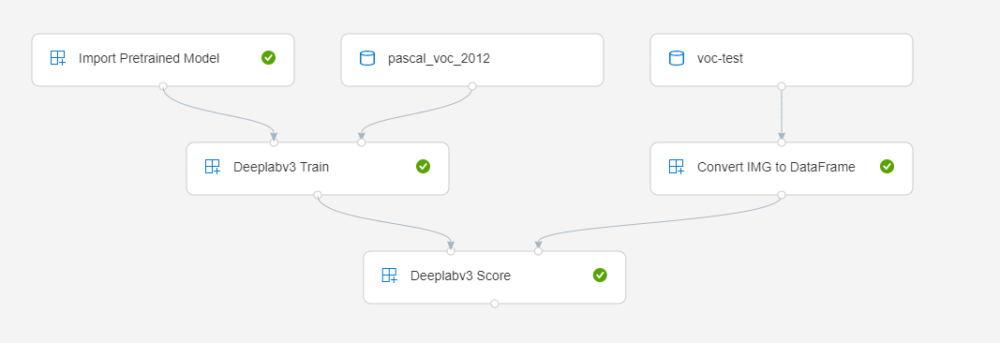
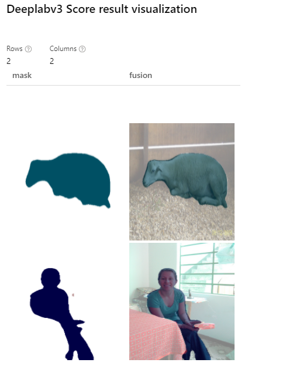

Semantic segmentation by deeplabv3
=========================================
This is a sample to demonstrate how to use custom modules in azure machine learning designer to implement semantic segmentation by deeplabv3.

Pipeline graph
-----------------------------

Dataset
-----------------------------
Here we register [PASCAL Visual Object Classes 2012](http://host.robots.ox.ac.uk/pascal/VOC/voc2012/VOCtrainval_11-May-2012.tar) "From web files"  via azure machine learning dataset. For test data, simply upload two images to an azure storage container and register it "From datastore" via azure machine learning dataset.

Results
-----------------------------
Visualize  "Deeplabv3 Score" module result, "mask" column shows segmented objects and "fusion" column shows fusion of mask and original images.

