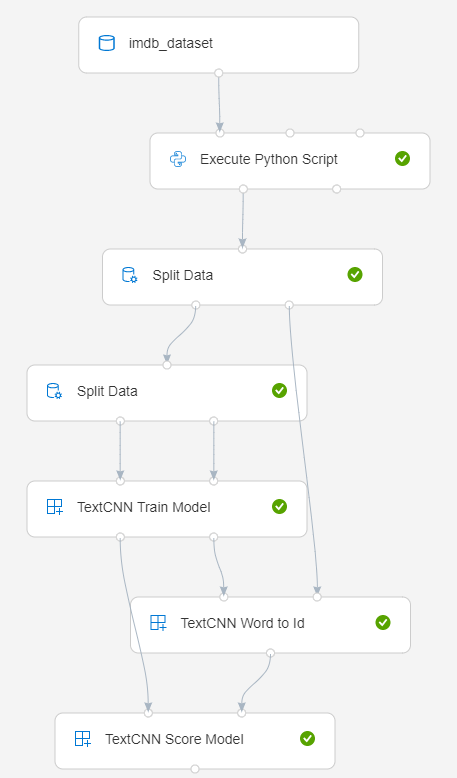
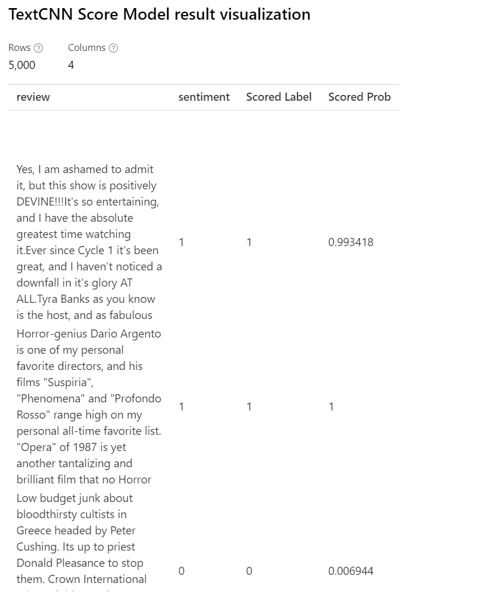
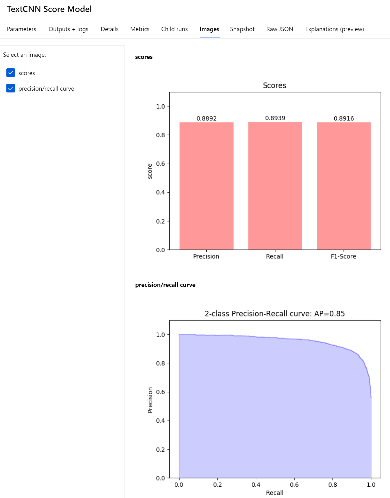

Text classification by convolutional neural network
=========================================
This is a sample to demonstrate how to use custom modules in azure machine learning designer to implement sentiment classification by text cnn.

Pipeline graph
-----------------------------

Dataset
-----------------------------
Here we upload [IMDB Dataset of 50k Movie Reviews](https://www.kaggle.com/lakshmi25npathi/imdb-dataset-of-50k-movie-reviews) to an azure storage container and then register it "From datastore" via azure machine learning dataset.

Results
-----------------------------
Visualize  "Text CNN Score" module result, "Scored Label" and "Scored Prob" columns are added to original data to show predicted results. Also record customized evaluation metric plots in "Images" tab of this module.

